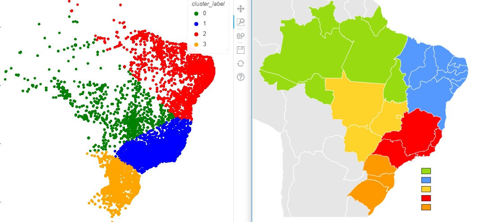

## Analise

Partindo do problema solicitado (Associando visitas a pedidos), o código foi colocado no arquivo `pedidos/job.py`. 

As funções criadas (_create_pedidos_df_, _create_visitas_df_, _merge_visita_produto_, _save_prepared_), foram colocadas
 no arquivo `jobs/pedidos/utils.py`. 
 
 Foram descartados vários atributos que não aportam informação à analise, tais como as dimensões do produto e 
 comprimentos do nome e da descrição do produto. As colunas separadas para analise foram selecionadas mediante a lista 
 **KEPT_COLUNS** e os novos nomes das colunas foram introduzidos usando o dicionário **COLUMN_RENAMES**, ambos sendo 
 encontrados no arquivo `jobs/pedidos/contants.py`
  
 O método (_prepare_files_) que faz uso de todas as funções anteriores também foi colocado no arquivo anterior
 (_utils.py_). O código ficou organizado da seguinte forma:
 
  ```Python
def prepare_files(data_str: str, hour: int, pedidos: str, produtos_df: pd.DataFrame, saida: str,
                        visitas: str) -> pd.DataFrame:
    date_partition = f"data={data_str}"
    hour_snnipet = f"hora={hour}"

    visitas_df = create_visitas_df(date_partition, hour_snnipet, visitas)

    pedidos_df = create_pedidos_df(date_partition, hour_snnipet, pedidos)

    visita_com_produto_pedido_df = merge_visita_produto(data_str, hour, pedidos_df, produtos_df,
                                                        visitas_df)
    visita_com_produto_pedido_cleaned = _prepare(visita_com_produto_pedido_df)

    write_depts(visita_com_produto_pedido_cleaned, COLUNA_DEPARTAMENTO)

    save_prepared(saida, visita_com_produto_pedido_cleaned)

    print(f"Concluído para {date_partition} {hour}h")

```


  
 ## Scale de dados
Os dados resumidos na etapa anterior, contém os seguintes atributos:

_{"id_produto", "id_visita", "id_pedido", "datahora", "prazo", "preco", "frete", "coordenadas"}_

Ainda assim, e para a nossa analise, são considerados somente os atributos 
_'preco', 'prazo' e 'frete'_. O atributo _"coordenadas"_ é dividido em colunas para _'latitude'_ e _'longitude'_ e são
adicionados à analise. Neste ponto também é criada a coluna 'convertido', que toma valores binarios quando uma visita resulta em uma 
compra(1) ou nao(0).

Nosso próximo passo é conseguir normalizar os dados e preparar os arrays para a clusterização que será realizada. A normalização é uma etapa
importante antes de qualquer análise, principalmente quando temos variáveis em escalas de valores diferentes ou variáveis com um rango de possíveis valores comprido.
Variáveis que tomam valores mais altos podem ser beneficiadas com relação a outras com escalas menores, mesmo que aportem mais informação na resolução do problema. 
A normalização serve para evitar esse tipo de problemas na análise.
  
O job criado para o caso fica localizado em `jobs/escala_pedidos/job_normalizaçao.py`. 

Com o fim de simplificar o código, adiciono o argumento **--scaler** , um string que serve de chave no dicionário 
**LIST_SCALER**, presente no arquivo `jobs/escala_pedidos/constants.py`

 _**@click.option('--scaler', type=str, help="Tipo de escalador")**_

_LIST_SCALER = {'normalizer': Normalizer(), 'minmaxscaler': MinMaxScaler(), 'standardscaler': StandardScaler(),
          'maxabsscaler': MaxAbsScaler(), 'robustscaler': RobustScaler(), 'powertransformer': PowerTransformer(),
               'sem_normalizar': None}_
               
Com isto, é possível escolher qual técnica de normalização será usada apartir de um string e construir o objeto certo na biblioteca Sklearn.

  
Desta forma todos os parametros necessários são passados. Para escalar os dados, executo o arquivo 
`jobs/pedidos/utils.py`. Na análise, usei os dados de 6 departamentos escolhidos mediante o argumento **--departamentos**:

_("perfumaria, artes, esporte_lazer, bebes, utilidades_domesticas, instrumentos_musicais")_

A continuação gerei os dois gráficos scatter para analisar as mudanças ocorridas pela transformações realizadas em 
cada um dos casos (`jobs/graphics/job_graphic.py`), assim como histogramas de cada atributo no mesmo caso(`jobs/graphics/job_histogram.py`).  

Idealmente para clusterização precisamos de dados padronizados de forma que a distribuição original seja mantida 
e a variança seja unitaria ou similar para todos os atributos. Usualmente técnicas de padronização estão otimizadas para 
distribuições gaussianas, então deveria funcionar melhor nesses casos.  
Olhando os histogramas de cada atributo, é possivel observar o efeito de cada uma das transformações realizadas. 

Transformações do tipo power transformer e normalizer modificam de forma significativa a distribuição dos dados, 
e não deveriam ser consideradas neste caso.  

Das outras transformações consideradas, é mais interessante pensar em aquelas que ficam com os dados
centralizados em 0. Dessas duas ultimas, robustscaler e standardscaler, o robustscaler deveria apresentar melhor
comportamento na presença de outliers, devido ao uso da mediana em vez da media e do uso do intervalo entre quartis 
como o rango de valores para o qual realizar a transformação. Isto permite eliminar efeitos provocados por outliers
na distribuição dos dados.

As transformações mais promissoras escolhidas para a análise posterior foram robustscaler, standardscaler e minmaxscaler. 
  

### Gerando clusters

Com os dados devidamente escalados é possível gerar então os dados particionados por `cluster_label`, `data` e `hora` 
e também por  `data`, `hora` e `cluster_label`, modificando a entrada da função **save_partitioned** , localizada em `data/saving.py`.

Além do job para kmeans(`clusters/job_kmeans.py`), foram implementados mais 4 jobs. As técnicas de clusterização selecionadas foram:

* MiniBatchKMeans(`job_minibatch_kmeans.py`)
* DBSCAN(`job_dbscan.py`)
* OPTICS(`job_optics.py`)
* Birch(`job_birch.py`)

Para a escolha, tentei colocar técnicas de clusterização que usem métodos de natureza diferente e que sejam escalaveis para grandes quantidades de dados.
No caso do kmeans e o MiniBatchKMeans, são baseadas em distâncias de acordo com a métrica escolhida (distáncia euclideana, manhattan). 
Já no caso de DBSCAN e OPTICS, usam uma estratégia de densidade e pontos próximos dentro de um rádio definido. 
O caso de Birch é um método de aglomeração que usa um esquema de árvore para agrupar instáncias em nós que vão crescendo e formando os clusters numa estratégia bottom-up.
A maior vantagem deste último é o fato de só precisar varrer o conjunto de dados em uma única passagem para construir o clustering.

Tambem foi criado um job que gera scatters ou histogramas(dependendo do argumento passado), que graficam todas as possíveis 
combinações duais entre a lista dos atributos que estejam sendo analisados. Neste caso, o job(`jobs/graphics/job_dash.py`) 
cria 3 gráficos de scatter ou histogramas com todas as possíveis combinações de frete, preço e prazo. 

De todas as combinações possíveis de escalador e clusterização, decidi escolher aquela com o robustscaler como transformador e o kmeans como técnica de clusterização. 
Nesta técnica é necesário especificar o número de clusters. Realizei várias corridas para diferentes números de clusters, e decidí usar 4 clusters. Para obter este 
parametro rodei a análise variando o número de clusters de 1 até 10, percebendo que apartir de 3 o 4, a adição de mais clusters não aporta informação relevante. 
O ajuste de parametros e hiperparametros para qualquer técnica de Machine Learning é feito normalmente usando uma técnica grid search ou busca exaustiva, 
onde rangos de parametros são testados.

Quando a clusterização foi feita foram consideradas restrições espaciais, isto porque pela natureza do problema é importante agrupar
regiões com características semelhantes. Explorando esta ideia, grafiquei os cluster espaciais, é claramente percibido que os clusters achados correspondem às 4 regiões mais habitadas 
do país(sudeste, nordeste, sul e centroeste). A região norte apresenta dados mais dispersos, o que dificulta a sua identificação. 
 
Para desenhar os mapas de uma forma mais direta, foi criado um job() que grafica agrupando por cluster label. 
 
 
 
 
 Estos resultados parecem ter muito sentido, dados os regimes diferentes de envío que existem usualmente para as diferentes regiões do país, 
 incluindo prazos e fretes diferentes. A única coluna que não tem uma dependencia espacial é o preço do produto. 
 
 O nosso antigo **job_dash.py** permite também criar os novos gráficos para comparar a distribuição dos pontos com relação aos clusters , 
 neste caso trocando o _"cluster_label"_ como agrupador (em vez da coluna _"convertidos"_). 
 
 Foi criado também um job que gera gráficos comparando a conversão total média de cada cluster para uma janela de data de entrada (`jobs/graphics/job_convert.py`).
  
O job final calcula a conversão agregada em uma escala recebida como parâmetro('dia','hora' e 'minuto')  e cria gráficos com séries temporais na escala digitada.
(`jobs/graphics/job_series.py`) 

Como conclusão temos que  cluster correspondente à regiao norte foi muito difícil de analisar (para os departamentos que realizamos a análise)
 pela esparsidade dos dados ao longo de vastos territorios.

Nas duas semanas analisadas(01/06-15/06), o cluster correspondente à região sul se mostrou com uma conversão acima da média das outras regiões 
 para as evoluções diárias e horárias. 
 
 Por outro lado, o cluster correspondente à região sudeste apresentou um número muito superior de visitas 
 totais(maior do que a soma dos outro três clusters) e apresentou também a conversão mais baixa das 4 regiões. Isto sugere a existência de 
 maior potencial nesta região, pelo qual podria recomendar-se realizar maiores investimentos nela para ampliar a conversão. 
 
 Um fenômeno temporal observado que vale a pena mencionar foi que para as duas semanas estudadas, o horario de final da tarde(17-20 horas)
 parece ser um horário de queda no parametro de conversão. 
 
 Para finalizar foi criado o pipeline do projeto. Foram incluidas as entradas na seçao console_scripts do setup.py.
 O projeto foi automatizado com a criaçao do arquivo shell `pipeline.sh`, o qual cria o virtualenv, instala o projeto nele 
 e executa os comandos dos jobs criados. Para correr o projeto, é necessario modificar o arquivo de configuraçoes(`variaveis.sh`)
 e incluir os path do dataset desejado e da pasta de saida onde serão colocados os resultados. Alguns outros parametros 
 podem ser modificados lá. Após isto, o projeto pode ser executado pelo comando `./pipeline.sh`
 
  


